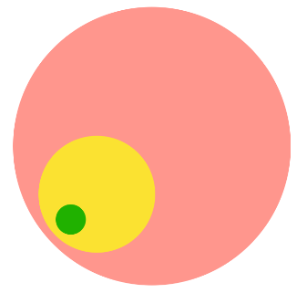

# 문제(Problem | WHY, how, what)

문제를 분별하는 것, 문제를 바라보는 관점에 따라 답은 달라집니다.  
누구에게는 문제가 될 수 있는 것도 누구에게는 문제가 안됩니다. 

 

> 우리에게 문제란 1차원 적인 직무적 업무 태스크 일수도 있고   
> 누구에게는 문제가 될 수 없는 것도 누구에게는 문제가 될 수 있는  
> 2차원 3차원 혹은 본질적 질문의 연속이 되는 다차원적인 문제 일 수 있습니다.  
>
> 문제를 찾아 해결 하는 방법 - 해결 능력도 다양합니다. 
>
> 모든 자원과 리소스를 고려하여 문제 해결에 대한 답을 내리는 것.   
> 효율성과 최적의 답을 찾는 것에 있습니다. 
>
> 우리는 문제에 대하여 1, 2, 3번 혹은  a, b, c 로 정해진 답을 내리지 않습니다.
> 문제의 타입과 문제의 깊이에 따라 답은 전혀 달라 집니다. 
>
> 아이러니한 답으로 문제에 대한 답이 틀리는 것 또한  
> 우리에게는 문제 해결 능력을 높이는 방법이라 생각합니다. 
>
> 위 문제에 대해 기준을 잡으로 합니다. 

## 1. 문제의 기준

1. 직무적 문제 (1차원적 문제)

   > 예) 컨셉변경 디자인, 기능변경 코딩,  

   판단기준

   - 생산성 ( 리소스 | 시간 | 결과 | 효율성 )
   - 완성도
   - 협업

2. 2차원적인 문제 

   판단기준 (위 상동) 

   > 시스템화에 대한 문제 고찰
   >
   > 고객의 본질적인  why 고찰
   >
   > *소양에 기준 : 시니어 최소 2인*

3. five why. 

   > 문제의 본질적인 끊임없는  why

 [문제해결영상](https://youtu.be/8YYRe0ex6wg)

## 2. 해결능력

1. 직무적 소양
2. 경험
3. 문제에 대한 분별력(지혜)
4. 지식(습득) 
5. 커뮤니케이션. 

- 모든 문제의 답 (고객의 데이터 : 핵심지표화)
  - Analysis

## 3. 문제해결 과정

- [`가이드 `](../README.md) 에 따른 핵심 목표를 우선시 
- 문제를 제기 (기록 - 틀린 문제란 없다.)
- 맥락화(가이드 기준)와 단순화-행동(문제의 방향을 3가지 이하 줄임)
- 상위 장 혹은 섹터의 핵심목표와 지표에 따른 문제제기 부합여부 체크. 
- 문제 해결 우선순위
  1. 팀간 혹은 시니어 미팅등. 
  2. 데이터 기반. (시도 - 프레임 전환)[영상](https://tv.naver.com/v/5555803)
  3. 경험
  4. 직관

### 문제제기

- 경험에 따른 문제 해결
- 모든 편견을 내려 놓고 프레임을 전환하기. [프레임영상보기](https://youtu.be/splHA7Nr6Do)
- 커뮤니케이션 (세상-책|인터넷, 고객, 동료)
- Imagination

1. why 에 대한 문제 제기와 해결점.

2. 시도와 도전에 따른 분석 그리고 기록의 명확화. 

3. 프레임을 깨는 것. 

