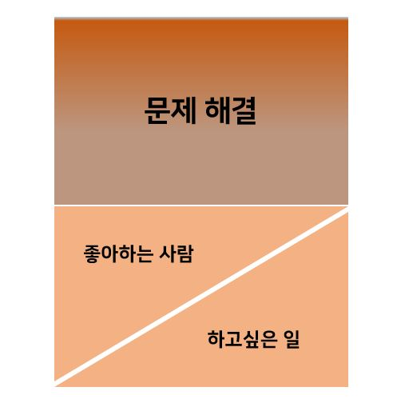

## 모두의 클래스 슬로건 변경

```노하우를 배우고 나누는 클래스 마켓```

```하고싶은 일을 좋아하는 사람들과 함께하세요```

-------

#### 우리는 어렵고 불가능한 문제를 풀어내는 사람들이며,

#### 하고 싶은 일을 좋아하는 사람들과 함께할 수 있게 만드는 사람들입니다.

= ```유토피아를 만드는 사람들```


#### 그런데 우리는 ''내가 하고 싶은 일을 좋아하는 사람들과 하고 있나요?''  



##### 1. 하고 싶은 일을 하는 것  

##### 2. 좋아하는 사람들과 함께 하는 것  

> 과연 이러한 유토피아를 우리 내부에서 만드는 것이 가능할까? 라는 생각이 듭니다.  


그래서 전제를 두고 생각을 조금 바꿔봤습니다.

- 모클의 본질은 다음 세대를 위해 일과 사람간의 관계를 재정의하는 것입니다.  
- 우리는 어렵고 불가능한 문제를 풀어내는 사람들입니다.  


우리가 일과 사람간의 관계를 재정의하기 위해 어렵고 불가능한 문제를 풀어내는 사람들이라면,  
또한 유토피아를 만들어내는 것이 어렵다면,  
**반대로**  
1. 하고 싶지 않은 일을 하지 않게 만들고  
2. 불편한 사람들과 함께 하지 않게 만드는 것  

> 이렇게 생각해보면 어떨까요?  

```HOW?```그러면 어떻게?

- 투명, 공정, 정당한 문서가 있고
- 나에 대한 상태를 표시하여 배려를 요구하고
- 단순한 'No'가 아닌 'No'에 대한 절차가 있고
- 틀림이 아닌 다름을 인정하고
- 문제 해결을 위해 학습하는 것을 인정하고  

```what?```  

- 서로를 존중 할 수 있는 곳
- 일에 자부심을 느끼는 곳
- 같이 일하고 싶은 곳
- 배려가 있는 곳
