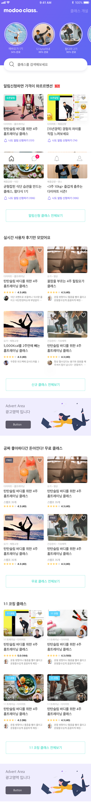

# 사용자단 - App Main

> 모두의 트레이닝 [실제 서비스 화면](www.modooclass.net)
> 
> 안드로이드 다운로드 링크 [Android Download Link](https://play.google.com/store/apps/details?id=com.modooclass)
> 
> 아이폰 다운로드 링크 [IPhone Download Link]()
>
> [디자인화면 - 링크필요]() 

- 이전      
- [**전체인덱스**](./README.md)     
- [다음 : ?]()

### **#목적**

1. 

### #핵심지표

- 클릭율 (방문자 대비)

### **#구성 - #기능**
업데이트 일시 : _2019_07_30

작성자 : [@이대준](https://github.com/DaeJunLee)

1. Top 
   - 로고
     > 클릭시 홈링크 연결 - 앱화면에서 로그 클릭시 앱 홈으로 이동
   - 클래스 개설
     > 클래스를 개설할수 있습니다.
   - Circle Icon
     > 자신이 참여하고 있는 강의들이 표시 됩니다.
   - 클래스나 코치를 검색해보세요
     > 클래스나 코치이름으로 클래스를 찾을수 있습니다.
2. Body  

### **#디자인**
업데이트 일시 : _2019_07_29

작성자 : [@신미소](https://github.com/meeso-modoo)

- [디자인 이미지(png) *update:0729](https://drive.google.com/open?id=1N2eaHlCSkL-ypSoj5mDWc_bMHmjXXDIB)

- [@신미소](https://github.com/meeso-modoo)  코멘트

  > 디자이너의 코멘트

### #개선사항

- [ ] 예) 로그인에 단일 버튼 보다는 다중소셜로그인을 해주세요. -> @김대형

### **#작업자**

- 기획 - [@김대형](https://github.com/jacob-modoo) [@신민수](https://github.com/minsoo-modoo)
- 디자인 - [@신미소](https://github.com/meeso-modoo)
- 서버 API - [@안지환](https://github.com/jihwan-modoo)
- 앱 개발 - [@이대준](https://github.com/DaeJunLee) [@조현민](https://github.com/hyunmin-modoo)

  
