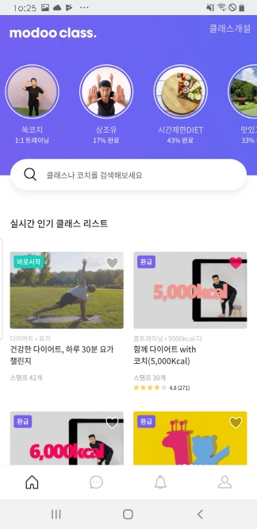
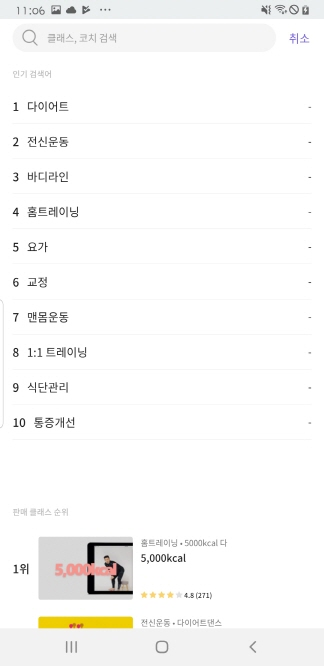
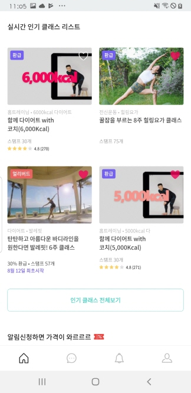
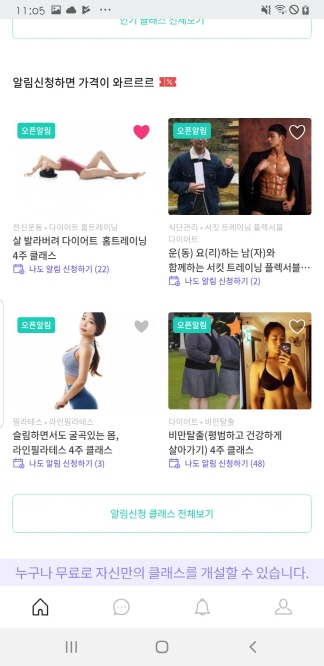
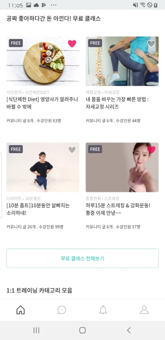
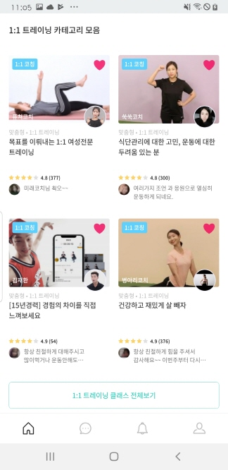

# 사용자단 - App Main

> 모두의 트레이닝 [실제 서비스 화면](www.modooclass.net)
> 
> 안드로이드 다운로드 링크 [Android Download Link](https://play.google.com/store/apps/details?id=com.modooclass)
> 
> 아이폰 다운로드 링크 [IPhone Download Link](https://itunes.apple.com/app/id1464482964)
>

- [이전](https://github.com/jacob-modoo/modooGuide/tree/master/service)      
- [**전체인덱스**](../class/README.md)     
- [다음 : 강의화면](../ch5_join_class/class/README.md)

### **#목적**

1. 

### #핵심지표

- 클릭율 (방문자 대비)

### **#구성 - #기능**
업데이트 일시 : 2019.07.30

작성자 : [@이대준](https://github.com/DaeJunLee)

모두의 클래스 애플리케이션 메인화면은

- [Top - 클래스개설, 참여하고 있는 클래스(Circle 아이콘)](#1Top)
- [Search - 클래스나 코치 찾기](#2Search)
- [Body - 클래스](#3Body)
- [Banner - 광고](#4Banner)

로 나누어져 있습니다.

#### 1.Top

- 클래스 개설 - 클래스를 개설할수 있습니다.
-  Circle 아이콘 - 자신이 참여하고 있는 강의들이 표시 됩니다.
   - 아이콘 클릭시 강의화면으로 이동
#### 2.Search

- [Top](#1.Top)의 `클래스나 코치를 검색해보세요` 클릭시 현재 화면이 표시됩니다.

#### 3.Body

<!---->
<!---->
<!---->
- 클래스 리스트를 유형별로 보여준다
  - 실시간 인기 클래스 리스트
  - 알림신청하면 가격이 와르르르
  - 공짜 좋아하다간 돈 아낀다! 무료 클래스
  - 1:1 트래이닝 카테고리 모음
   
#### 4.Banner

- 광고할수 있는 배너 영역 입니다 - 모두의 클래스 이벤트 및 광고 영역

### **#디자인**
업데이트 일시 : 2019.07.29

작성자 : [@신미소](https://github.com/meeso-modoo)

- [디자인 이미지(png) *update:0729](https://drive.google.com/open?id=1N2eaHlCSkL-ypSoj5mDWc_bMHmjXXDIB)

- [@신미소](https://github.com/meeso-modoo)  코멘트

  > **OVERVIEW**
  >
  > 앱상에서의 머테리얼 디자인은 사용자를 동기부여할 수 있어야 하며 미니멀한 구성을 통해 UX를 단순화하여 소통, 관계와 공유에 집중하도록 유도한다. 
앱의 메인화면은 다양한 클래스를 보여주는 공간으로 할인, 시작일, 카테고리등 다양한 타입의 클래스를 담기위해 모듈화 시스템을 통하여 통일성있는 디자인과 일관성이있는 사용자 경험을 제공한다.
  
  > **COLOUR**
  >
  > 에너지틱하며 액티브한 브랜드 이미지를 전달하며, 플랫폼 특성을 고려한 블루계열의 컬러를 주조색으로 사용하여 팔레트를 확장해 나간다.
  
  > **TYPOGRAPHY**
  >
  > 타이틀과 본문은 각 디바이스별 시스템폰트를 사용하여 가독성을 높이고 장식성을 배제하여 컨텐츠에 집중성을 높인다.

### #개선사항

- [ ] 예) 로그인에 단일 버튼 보다는 다중소셜로그인을 해주세요. -> @김대형

### **#작업자**

- 기획 - [@김대형](https://github.com/jacob-modoo) [@신민수](https://github.com/minsoo-modoo)
- 디자인 - [@신미소](https://github.com/meeso-modoo)
- 서버 API - [@안지환](https://github.com/jihwan-modoo)
- 앱 개발 - [@이대준](https://github.com/DaeJunLee) [@조현민](https://github.com/hyunmin-modoo)
