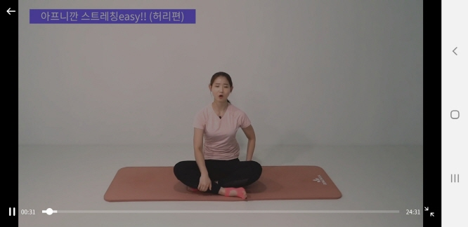
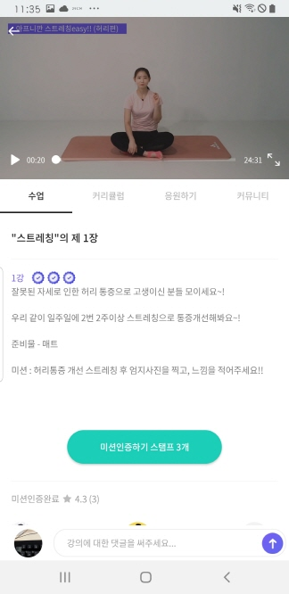
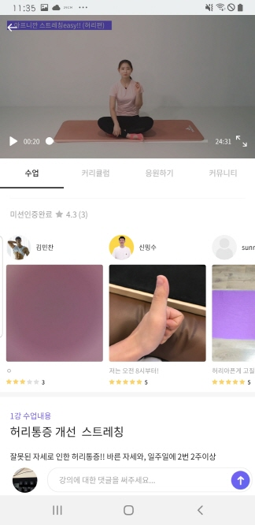

# 사용자단 - Class(강의화면)

> 모두의 트레이닝 [실제 서비스 화면](www.modooclass.net)

- [이전](../README.md)      
- [**메인인덱스**](../README.md)     
- [다음 : 커리큘럼]( ../curriculum/README.md)

### **#목적**

1. 

### #핵심지표

- 클릭율 (방문자 대비)

### **#구성 - #기능**

업데이트 일시 : _2019_07_31_

작성자 : [@이대준](https://github.com/DaeJunLee)

모두의 클래스 애플리케이션 메인화면은

- [Top - 동영상 플레이](#1Top)
- [Body - 수업내용, 미션인증리스트, 댓글리스트 등](#2Body)
- [Bottom - 댓글 입력](#3Bottom)

#### 1.Top

- 동영상을 상단에 표시되며, 동영상 영역안에서 동영상을 컨트롤 할수 있도록 컨트롤러가 존재합니다.

#### 2.Body

- 수업내용을 확인할수 있습니다.
  - 상세내용 : 수업에 대한 상세 내용을 볼수 있습니다.
  - 미션인증리스트 : 현재 참여하고 있는 사용자들이 올린 미션을 볼수 있습니다.
  - `다음강의로 이동` : 다음 수업으로 이동할수 있습니다.
  - `미션완료` : 수업에 미션이 존재하며 미션완료시 다음강의로 이동할수 있습니다.
  - `리뷰작성` : 수업의 모든 커리큘럼을 완료했을 경우 리뷰를 작성할수 있습니다.
  - 댓글 리스트 : 수업에 참여한 사람들만 댓글을 남길수 있습니다.

#### 3.Bottom
- 수업에 댓글을 남길수 있습니다.

### **#디자인**

- [디자인 이미지 링크 (최근 업데이트 이미지) - 링크필요]()

- [@신미소](https://github.com/meeso-modoo)  코멘트

  > 디자이너의 코멘트

### #개선사항

- [ ] 예) 로그인에 단일 버튼 보다는 다중소셜로그인을 해주세요. -> @김대형

### **#작업자**

- 기획 - [@김대형](https://github.com/jacob-modoo) [@신민수](https://github.com/minsoo-modoo)
- 디자인 - [@신미소](https://github.com/meeso-modoo)
- 서버 API - [@안지환](https://github.com/jihwan-modoo)
- 앱 개발 - [@이대준](https://github.com/DaeJunLee) [@조현민](https://github.com/hyunmin-modoo)

  
