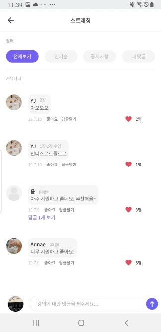

# 사용자단 - Community(강의화면)

> 모두의 트레이닝 [실제 서비스 화면](https://www.modooclass.net)
> 
> 안드로이드 다운로드 링크 [Android Download Link](https://play.google.com/store/apps/details?id=com.modooclass)
> 
> 아이폰 다운로드 링크 [IPhone Download Link](https://itunes.apple.com/app/id1464482964)
>
> [디자인화면 - 링크필요]() 

- 이전      
- [**메인인덱스**](../README.md)     
- [다음 : 프로필]( ../chat/README.md)

### **#목적**

1. 

### #핵심지표

- 클릭율 (방문자 대비)

### **#구성 - #기능**

업데이트 일시 : 2019.07.31

작성자 : [@조현민](https://github.com/johyunmin)

모두의 클래스 애플리케이션 강의(커뮤니티) 화면은

- [Top - 제목](#1.Top)
- [Menu - 커뮤니티 메뉴](#2.Menu)
- [Body - 커뮤니티 댓글 리스트](#3.Body)
- [Bottom - 댓글 쓰기](#4.Bottom)

로 나누어져 있습니다.

#### 1.Top

- 클래스의 제목이 나옵니다.
- 뒤로가기 버튼을 통해 영상으로 돌아갑니다.

#### 2.Menu

- 필터를 통하여 댓글의 표현을 달리해줍니다.

#### 3.Body

- 사람들이 쓴 댓글을 보여줍니다 기본으로는 최신 시간 순으로 나타내 줍니다.
- 친구의 사진을 클릭하거나 친구의 이름을 친구의 프로필로 이동합니다.
- 좋아요를 클릭하면 그 댓글의 좋아요 명수가 올라갑니다 재 클릭하면 좋아요 취소됩니다.
- 답글달기 혹은 내용을 누르면 그 댓글에 달린 대댓글을 볼수 있는 화면으로 이동합니다.

#### 4.Bottom

- 커뮤니티에 댓글을 남길수 있습니다.
- 자신의 사진을 클릭하면 자신의 프로필화면으로 이동할수 있습니다.

### **#디자인**

- [디자인 이미지 링크 (최근 업데이트 이미지) - 링크필요]()

- [@신미소](https://github.com/meeso-modoo)  코멘트

  > 디자이너의 코멘트

### #개선사항

- [ ] 예) 로그인에 단일 버튼 보다는 다중소셜로그인을 해주세요. -> @김대형

### **#작업자**

- 기획 - [@김대형](https://github.com/jacob-modoo) [@신민수](https://github.com/minsoo-modoo)
- 디자인 - [@신미소](https://github.com/meeso-modoo)
- 서버 API - [@안지환](https://github.com/jihwan-modoo)
- 앱 개발 - [@이대준](https://github.com/DaeJunLee) [@조현민](https://github.com/hyunmin-modoo)

  
