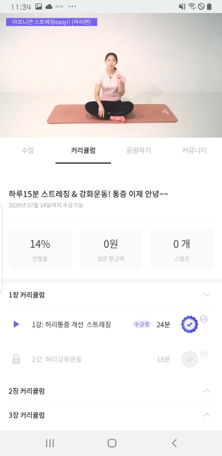
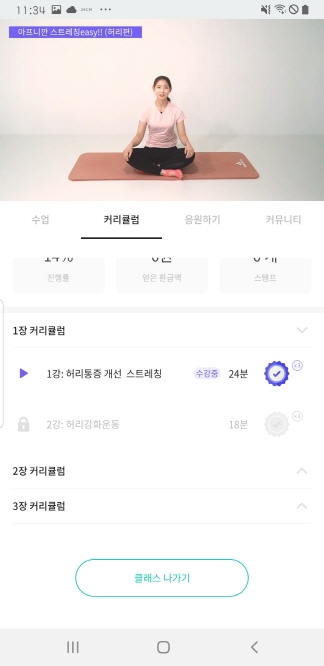

# 사용자단 - Curriculum(강의화면)

> 모두의 트레이닝 [실제 서비스 화면](https://www.modooclass.net)
> 
> 안드로이드 다운로드 링크 [Android Download Link](https://play.google.com/store/apps/details?id=com.modooclass)
> 
> 아이폰 다운로드 링크 [IPhone Download Link](https://itunes.apple.com/app/id1464482964)
>
> [디자인화면 - 링크필요]() 

- 이전      
- [**메인인덱스**](../README.md)     
- [다음 : 프로필]( ../cheer/README.md)

### **#목적**

1. 

### #핵심지표

- 클릭율 (방문자 대비)

### **#구성 - #기능**

업데이트 일시 : 2019.07.31

작성자 : [@조현민](https://github.com/johyunmin)

모두의 클래스 애플리케이션 알림 화면은

- [Top - 동영상 재생](#1.Top)
- [Menu - 강의 메뉴](#2.Menu)
- [Body - 강의 커리큘럼 정보](#3.Body)

로 나누어져 있습니다.

#### 1.Top
- 영상이 재생됩니다

#### 2.Menu
- 메뉴를 선택해서 영상은 재생되고 있지만 다른 화면을 볼수 있습니다. 단 커뮤니티를 클릭하면 영상이 일시정지 합니다.영상이 재생됩니다

#### 2.Body

- 1장의 화살표를 클릭하게되면 그 안에 있느 각 강의들이 펼쳐집니다.
- 수강중인 강의의 장이 펼쳐집니다. 
- 각 강의를 누르면 그 강의의 정보와 영상으로 변경됩니다.
- 무료로 진행중인 클래스인 경우 클래스 나가기라는 버튼이 보이며 강의를 나갈수 있습니다.

### **#디자인**

- [디자인 이미지(png) *update: 0724](https://drive.google.com/open?id=1aljDi_y2EvaTIFgsISmj-CQS2iBAxazW)

- [@신미소](https://github.com/meeso-modoo)  코멘트

     > 사용자의 수업진행사항을 한눈에 보여주기 위해 스테이트별 컬러 차이를 두어 활성/비활성과 구분을 명확하게 한다.

### #개선사항

- [ ] 예) 로그인에 단일 버튼 보다는 다중소셜로그인을 해주세요. -> @김대형

### **#작업자**

- 기획 - [@김대형](https://github.com/jacob-modoo) [@신민수](https://github.com/minsoo-modoo)
- 디자인 - [@신미소](https://github.com/meeso-modoo)
- 서버 API - [@안지환](https://github.com/jihwan-modoo)
- 앱 개발 - [@이대준](https://github.com/DaeJunLee) [@조현민](https://github.com/hyunmin-modoo)

  
