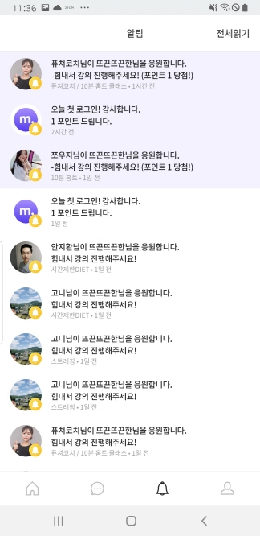

# 사용자단 - Alarm

> 모두의 트레이닝 [실제 서비스 화면](https://www.modooclass.net)
> 
> 안드로이드 다운로드 링크 [Android Download Link](https://play.google.com/store/apps/details?id=com.modooclass)
> 
> 아이폰 다운로드 링크 [IPhone Download Link](https://itunes.apple.com/app/id1464482964)
>
> [디자인화면 - 링크필요]() 

- 이전      
- [**메인인덱스**](../README.md)     
- [다음 : 프로필]( ../profile/README.md)

### **#목적**

1. 

### #핵심지표

- 클릭율 (방문자 대비)

### **#구성 - #기능**
업데이트 일시 : 2019.07.31

작성자 : [@조현민](https://github.com/johyunmin)

모두의 클래스 애플리케이션 알림 화면은

- [Top - 알림 전체읽기](#1.Top)
- [Body - 알리 리스트](#2.Body)

로 나누어져 있습니다.

#### 1.Top
- 전체 읽기 버튼을 통한 알림 읽음 처리

#### 2.Body

- 알람 리스트르 보여준다
- 각각의 알림 타입에 따라 이동하는 경로가 다르다.
  - push_type 0 -> 웹뷰 이동
  - push_type 1 -> 클래스 상세 화면 이동
  - push_type 2 -> 클래스 상세 내 커뮤니티화면 이동
  - push_type 3 -> 댓글 상세 화면 이동
  - push_type 4 -> 친구 프로필화면 이동
  - push_type 5 -> 홈화면으로 이동
  - push_type 6 -> 프로필화면으로 이동
  - push_type 7 -> 알림화면으로 이동
  - push_type 8 -> 메세지화면으로 이동
   

### **#디자인**

업데이트 일시 : 2019.08.02

작성자 : [@신미소](https://github.com/meeso-modoo)

- [디자인 이미지(Zeplin) *update:0801](https://app.zeplin.io/project/5d414079bfc64e0d78ff6434?seid=5d414503c426fc88302b61da)

- 알람 리스트는 유저아바타, 알림 타입별 아이콘, 알림내용, 클래스명, 시간으로 이루어져 있다. 앱 전반에 라인아이콘을 사용하였으나 알림 화면단 내에서는 예외적으로 면으로 이루어진 아이콘을 사용하되 모서리커브와 스타일은 유지한다.

### #개선사항

- [ ] 예) 로그인에 단일 버튼 보다는 다중소셜로그인을 해주세요. -> @김대형

### **#작업자**

- 기획 - [@김대형](https://github.com/jacob-modoo) [@신민수](https://github.com/minsoo-modoo)
- 디자인 - [@신미소](https://github.com/meeso-modoo)
- 서버 API - [@안지환](https://github.com/jihwan-modoo)
- 앱 개발 - [@이대준](https://github.com/DaeJunLee) [@조현민](https://github.com/hyunmin-modoo)

  
