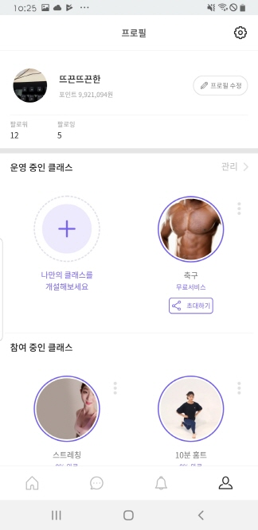
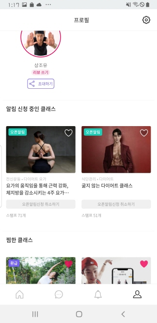
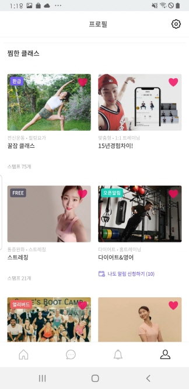

# 사용자단 - profile

> 모두의 트레이닝 [실제 서비스 화면](https://www.modooclass.net)
> 
> 안드로이드 다운로드 링크 [Android Download Link](https://play.google.com/store/apps/details?id=com.modooclass)
> 
> 아이폰 다운로드 링크 [IPhone Download Link](https://itunes.apple.com/app/id1464482964)
>
> [디자인화면 - 링크필요]() 

- 이전      
- [**메인인덱스**](../README.md)     

### **#목적**

1. 

### #핵심지표

- 클릭율 (방문자 대비)

### **#구성 - #기능**

업데이트 일시 : 2019.07.31

작성자 : [@조현민](https://github.com/johyunmin)

모두의 클래스 애플리케이션 프로필 화면은

- [Top - 프로필 제목](#1.Top)
- [Body - 프로필 리스트](#2.Body)

로 나누어져 있습니다.

#### 1.Top
- 프로필이라는 제목 옆 톱니바퀴를 클릭하면 앱 설정에 관련된 화면으로 이동한다.

#### 2.Body

Body-1

- 나의 기본 정보 보이며 프로필 수정 버튼을 클릭하면 나의 정보를 수정 할 수 있는 웹뷰로 연결된다.
- 운영 중인 클래스에서 관리를 클릭하면 운영중인 클랫 관리 웹뷰로 연결된다.
- 나만의 클래스 개설을 누르면 클래스 개설 웹뷰로 연결된다.
- 초대하기를 클릭하면 카카오톡으로 공유를 할수 있다.
- 운영중인 클래스 옆 점 3개 버튼을 누르면 운영중인 클래스를 수정 할 수 있는 웹뷰로 이동하거나 삭제 할 수 있다.
- 참여중인 클래스를 클릭하면 이동 한다
  - 참여중인 클래스가 수강 완료가 되지 않은 경우 강의를 들을 수 있는 화면으로 이동한다.
  - 강의가 완료 되면 리뷰 쓰기로 이동 할 수 있다.
  - 리뷰쓰기도 완료 된 경우 강의가 회색으로 처리되어 보여진다.
- 참여중인 클래스의 옆 점 3개 버튼을 누르면 강의를 나갈 수 있다.

Body-2

- 오픈알림을 한 이미지나 제목을 클릭하면 그 클래스의 강의 소개 웹뷰로 이동한다.
- 오픈알림신청 취소하기를 누르면 알림이 취소되며 목록에서 사라진다.
- 오픈알림을 신청한 클래스상단 하트를 누르면 찜하기가 된다.

Body-3

- 찜한클래스를 클릭하면 그 클래스의 소개 웹뷰로 이동한다.
- 오픈알림을 신청한 클래스상단 하트를 누르면 찜하기가 취소된다.

### **#디자인**

- [디자인 이미지 링크 (최근 업데이트 이미지) - 링크필요]()

- [@신미소](https://github.com/meeso-modoo)  코멘트

  > 디자이너의 코멘트

### #개선사항

- [ ] 예) 로그인에 단일 버튼 보다는 다중소셜로그인을 해주세요. -> @김대형

### **#작업자**

- 기획 - [@김대형](https://github.com/jacob-modoo) [@신민수](https://github.com/minsoo-modoo)
- 디자인 - [@신미소](https://github.com/meeso-modoo)
- 서버 API - [@안지환](https://github.com/jihwan-modoo)
- 앱 개발 - [@이대준](https://github.com/DaeJunLee) [@조현민](https://github.com/hyunmin-modoo)

  
