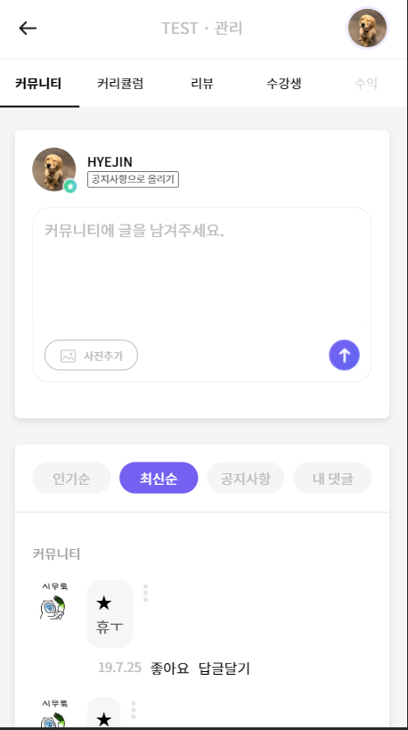
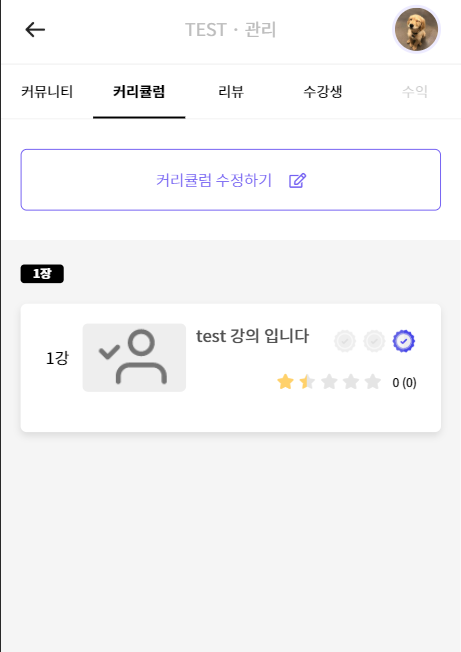
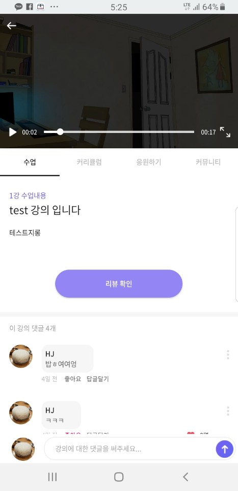
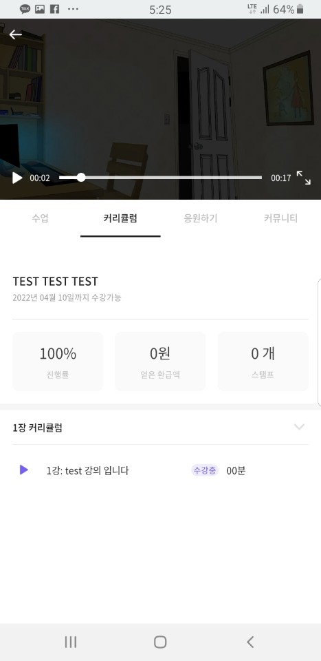

# 커뮤니티 관계

**[문제]**  
코치가 내가 만든 클래스를 사용자 입장에서 볼 수 없다.

**[왜]**  
코치가 만든 클래스가 코치가 의도한대로 표현이 되었는지 사용자 입장에서 확인하고 사용자들과 소통하고싶기 때문이다.
  
> 클래스 관리 화면에서 겹치는 탭 메뉴 안의 내용들을 앱의 사용자 화면단과 맞춘다

 
 

**[문제]**   
현재는 커뮤니티 활성도가 부족하다. (사용자 참여가 부족하다)

**[왜]**  
사람들은 더 연결되기를 원하고 나와 맞는 사람을 찾기를 원하는데  
같은 수업을 듣는 사람과 소통할 수 있는 방식이 커뮤니티로 제한되어 있다.  
아직 메세지 창도 없고, 코치가 영상을 올려도 댓글 다는 사람들이 극 소수다.

> 1. 관종을 모은다.  
> 1. 메세지 기능을 개발한다 (개발 1순위)
> 1. 코치가 영상에서 댓글이나 사용자 참여를 유도한다  
> ex) 오늘도 미션 완료해주시고 궁금한거 있으시면 댓글 남겨주세요!!
> 1. 가장 먼저 댓글을 입력한 사람에게 포인트 주거나 코치가 가장 처음에 사용자 참여를 위한 질문을 던진다.  
> 1. 코치는 댓글에 답글 달아주기
> 1. 매일 할 수 있고, 쉽게 인증 할 수 있는 챌린지 형식의 클래스를 오픈한다. 사람들이 리뷰나 사진을 찍고 글을 쓰는 걸 행동을 유도하게 끔 만들면 좋겠다.  

 

# 클래스 개설

 

# 클래스를 잘 찾는다

**[문제]**   
고객들이 원하는 클래스를 찾기 힘들다.

**[왜]**  
사람의 성향은 모두 다르고 원하는 것이 다르다. 원하는 클래스를 빠르게 찾지 못하면 앱의 리텐션이 낮아지기 때문에 그 사람에 맞추어서 클래스를 추천해준다면 클래스참여율이 높아질 것이다.

> 1. 카테고리와 정렬방식
> 스트레칭, 요가, 헬스 같이 주제별로 카테고리를 나누어서 클래스를 볼 수 있도록 변경
> 인기순, 리뷰순, 가격 , 알림신청 등 원하는 방식으로 클래스를 정렬할 수 있도록 변경

> 2. 사용자에 따른 클래스 추천 로직화
> - 클래스의 카테고리와 주제를 나눈다.
> - 특정사용자의 그 주제의 클릭수와 결제수를 집계하여 점수를 부여한다.
> - 특정사용자가 점수가 높은 주제의 클래스를 상단에 추천해준다.

**[문제]**   
인기클래스가 인기의 기준과 순위가 없다.

**[왜]**  
코치에게 경쟁심리를 자극해줄 수 있고, 사용자에게는 정확한 정보를 신뢰있게 직관적으로 제공해줄 수 있다.
그리고 이 기준이 없으면 추후에 문제가 발생할 수 있다. 

>수강생 수를 인기의 기준을 삼고 수강생 수가 가장 많은 순으로 10개 클래스를 순위와 함께 소개시켜준다. (TOP10 클래스)

 

**[문제]**   
**[왜]**  
>
